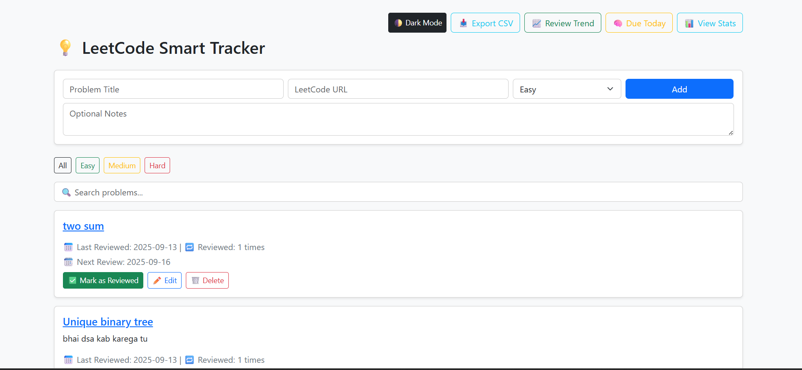

# 💡 LeetCode Smart Tracker

A Flask web application to track LeetCode problems, schedule reviews using spaced repetition, and visualize progress.

## Features

- Add, edit, and delete LeetCode problems.
- Track problem details like URL, difficulty, and notes.
- Spaced repetition algorithm to schedule the next review date.
- View problems due for review today.
- Filter problems by difficulty.
- View statistics with charts for difficulty distribution and review trends.
- Dark mode toggle.
- Export all data to a CSV file.

## Technologies Used

- **Backend:** Python, Flask
- **Database:** SQLite
- **Frontend:** HTML, CSS, JavaScript
- **Charting:** Chart.js
- **Styling:** Bootstrap 5

## Setup and Installation

To run this project locally, follow these steps:

1. **Clone the repository:**

   git clone [https://github.com/your-username/your-repo-name.git](https://github.com/your-username/your-repo-name.git)
   cd your-repo-name

2.   **Create and activate a virtual environment:**

  python -m venv venv
  venv\Scripts\activate

3. **Install the required dependencies:**

  pip install -r requirements.txt

4. **Run the application:**

   python app.py

 * => The application will be available at http://127.0.0.1:5000.
